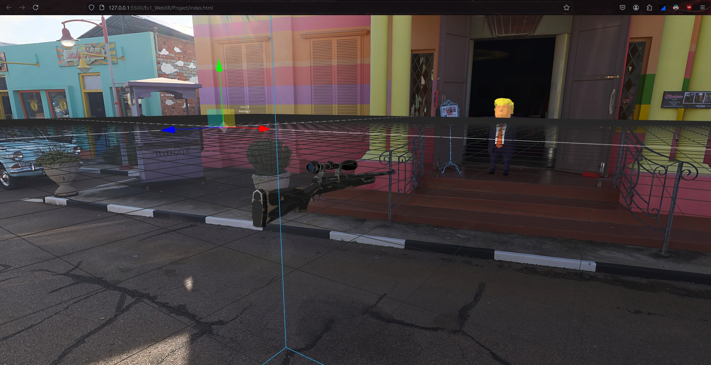
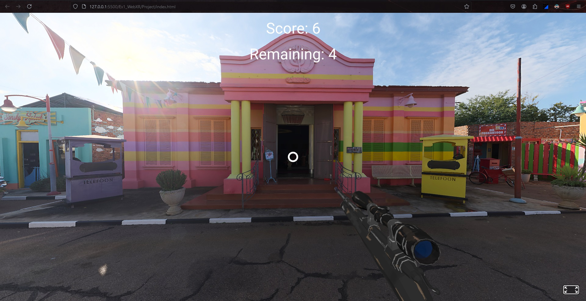
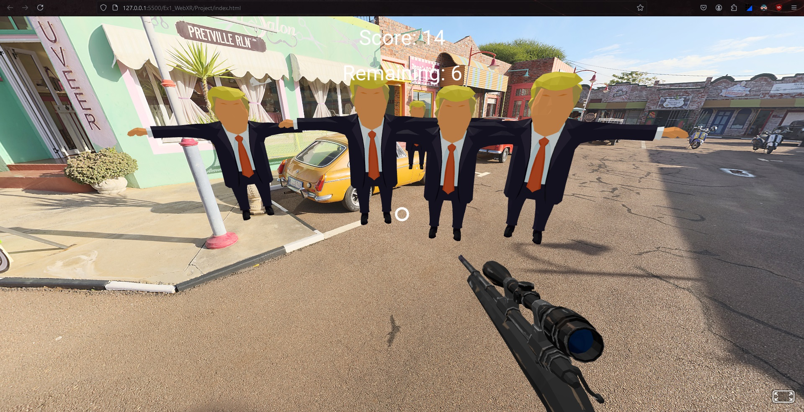

# Ejercicio 1 -> WebXR

## Datos Identificativos
- **Nombre**: Gabriel Álvarez de Pablo
- **Alias / Pseudónimo / Apodo / Nickname**: Wismy

# Índice
- [Tecnología Empleada y Justificación](#tecnología-empleada-y-justificación)
- [Diseño Inicial del Escenario](#diseño-inicial-del-escenario)
- [Prototipo de Escenario](#prototipo-de-escenario)
- [Desarrollo del Videojuego](#desarrollo-del-videojuego)
- [Conclusiones](#conclusiones)
- [Bibliografía](#bibliografía)

## Tecnología Empleada y Justificación
Para el desarrollo de este videojuego web 3D, se han utilizado las siguientes tecnologías:

- **A-Frame (versión 1.6.0)**: Framework de realidad virtual para la web que permite crear experiencias 3D y VR con HTML y Entity-Component System. Se eligió por su facilidad de uso y su capacidad para crear escenas 3D interactivas sin necesidad de conocimientos profundos en WebGL.
- **HTML5**: Para la estructura básica de la página web.
- **JavaScript**: Para la lógica del juego y la interactividad.
- **GLTF Models**: Para los modelos 3D de Trump y el francotirador.

La elección de estas tecnologías se justifica por su compatibilidad con navegadores web modernos, lo que permite una amplia accesibilidad sin necesidad de plugins adicionales. Además, A-Frame proporciona una curva de aprendizaje suave para el desarrollo de entornos 3D interactivos.

## Diseño Inicial del Escenario

El diseño inicial contemplaba un entorno espacial con múltiples órbitas donde se moverían los objetivos (modelos de Trump). El jugador se posicionaría en el centro con una vista en primera persona y un arma de francotirador.

## Prototipo de Escenario

### Suelo
Junto al cielo, es el HDRi importado.

### Elementos
- **HDRi**: Escenario visible, tanto el suelo como los edificios y el cielo.
- **Modelos 3D de Trump**: Distribuidos en diferentes posiciones y órbitas alrededor del jugador.
- **Modelo 3D de francotirador**: Visible en la vista del jugador como arma principal.
- **Órbitas**: Entidades invisibles que sirven como caminos de movimiento para los modelos de Trump.

### Cielo
Junto al suelo, es el HDRi importado.

### Cámara
La cámara está configurada en primera persona y no se desplaza, con controles de mirada y un cursor para apuntar y disparar.

## Desarrollo del Videojuego

### Funcionalidad del Videojuego
El juego consiste en dos rondas:

1. **Primera Ronda**: El jugador debe disparar a los modelos de Trump que orbitan alrededor. Cada acierto suma puntos y reduce el contador de objetivos restantes.
2. **Segunda Ronda**: Los modelos de Trump reaparecen y ahora se mueven hacia el centro. El jugador debe eliminarlos antes de que lleguen a él, o perderá el juego.

El juego termina cuando se eliminan todos los objetivos (victoria) o cuando un Trump llega al jugador (derrota).

### Gameplay del Videojuego
- RONDA 1

- RONDA 2

### URL para el Acceso al Juego
[Aquí se incluiría la URL donde se puede jugar al videojuego]

## Conclusiones
El desarrollo de este videojuego ha permitido explorar las capacidades de A-Frame para crear experiencias 3D interactivas en la web. Se han implementado conceptos como:

- Creación de escenas 3D en el navegador
- Manejo de modelos 3D y texturas
- Implementación de lógica de juego con JavaScript
- Creación de animaciones y movimientos en el espacio 3D
- Interacción del usuario mediante clicks y movimiento de cámara

El resultado es un juego simple pero funcional que demuestra el potencial de las tecnologías web para crear experiencias 3D accesibles.

## Bibliografía
- [Sketchfab -> Modelo 3D de Trump](https://sketchfab.com/3d-models/lowpoly-trump-free-character-ba7b382c918b40e6b07011da4ff3ebc0)
- [Sketchfab -> Modelo 3D del Francotirador](https://sketchfab.com/3d-models/low-poly-stylized-sniper-gun-f122f26db82841399f5db24e10246596)
- [Poly Haven -> HDRi del escenario](https://polyhaven.com/a/pretville_street)
